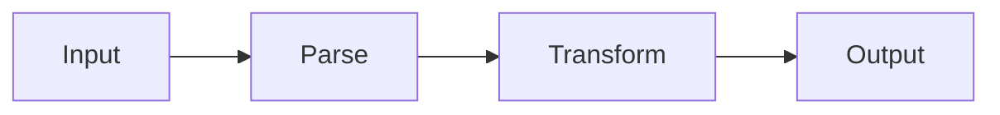

# Literate Programming

Transform a codebase into a literate program: a document written for human comprehension that also generates the original source code.

## Overview

A literate program is a single `.lit.md` markdown file that serves as both documentation and source code. It produces two outputs:

- **WEAVE** → A PDF (via Pandoc) with prose, diagrams, math, and syntax-highlighted code.
- **TANGLE** → The original source files, extracted from named code chunks.

The prose explains *why* the code exists and how it works. The code is embedded in named chunks that can reference each other. The reader follows a narrative, not a file listing.

## Chunk Syntax

Code blocks become named chunks by adding attributes:

````
```ts {chunk="handle-request" file="src/server.ts"}
<<parse-headers>>
<<route-request>>
<<send-response>>
```
````

- `chunk="name"`: names the block (required for inclusion in the tangled output)
- `file="path"`: marks it as a root chunk that produces an output file
- `<<chunk-name>>`: references another chunk. Expanded recursively during tangling

Same-named chunks are concatenated in document order (additive chunks), enabling progressive elaboration.

For full syntax details, see `references/chunk-syntax.md`.

## Workflow

When the user asks you to create a literate program from a codebase, follow these steps:

### Step 0: Check for Existing .lit.md

Before analyzing the codebase, check if a `.lit.md` file already exists in the project. If one exists:

1. Skip creation entirely. Do not recreate from scratch.
2. Tangle the existing `.lit.md` to regenerate source files:
   ```bash
   bun run scripts/tangle.ts <file.lit.md> --output-dir <dir>
   ```
3. Weave the existing `.lit.md` to regenerate the PDF:
   ```bash
   pandoc <file.lit.md> -o <file.pdf> --pdf-engine=xelatex --filter mermaid-filter --toc --number-sections
   ```
4. Report what was done and exit.

If no `.lit.md` exists, proceed with the steps below to create one.

### Step 1: Find Entry Points

Locate where execution begins. Check `package.json`, `main()` functions, `__main__.py`, or the public API surface for libraries. This is where the narrative starts.

### Step 2: Trace Data Flow

Follow data from input to output through the codebase:
- What does the program consume? (CLI args, files, network, env vars)
- What transformations does it apply?
- What does it produce?

Each stage of this pipeline becomes a candidate section.

### Step 3: Identify Background Processes

Look for event loops, worker threads, scheduled tasks, signal handlers, and message queues. These are parallel flows that interact with the main pipeline and deserve their own sections.

### Step 4: Plan Diagrams

Choose Mermaid diagrams to illustrate the architecture before showing code:
- Module dependencies → `graph TD`
- Request lifecycle → `sequenceDiagram`
- Data pipeline → `graph LR`
- State machines → `stateDiagram-v2`

Place each diagram *before* the code it describes.

### Step 5: Determine Psychological Order

Present code in the order easiest to understand, not the order files appear on disk. Common strategies:
- **Top-down**: Architecture first, then drill into components
- **Data-centric**: Core types first, then operations
- **Narrative**: Follow a request/event from start to finish

Each section should build on the previous one. Defer edge cases and error handling until after the happy path is clear.

### Step 6: Plan the Outline

Write a section outline before writing any prose or code. Each section should:
1. Motivate the problem it solves
2. Show a diagram (if helpful)
3. Present the code in named chunks
4. Explain non-obvious decisions

For detailed guidance, see `references/analysis-workflow.md`.

### Step 7: Verify Before Overwriting

Before tangling for the first time (which overwrites source files), run the tangler in verify mode to confirm the `.lit.md` captures every file completely:

```bash
bun run scripts/tangle.ts project.lit.md --output-dir ./src/ --verify
```

This compares tangled output against existing files without writing anything. If any file differs, it reports the first mismatched line and exits with code 1. Fix all mismatches in the `.lit.md`, then tangle for real.

## Writing the .lit.md

### Document Structure

```markdown
---
title: "Project Name — A Literate Program"
author: "Author"
toc: true
# (see assets/pandoc-header.yaml for full template)
---

# Introduction
Motivate the project. What problem does it solve? What is the key insight?

# Section Title
Prose explaining this part of the system...

\```lang {chunk="chunk-name" file="path/to/file.ext"}
code here
<<reference-to-other-chunk>>
\```

More prose connecting ideas...
```

### Writing Principles

1. **Byte-for-byte completeness**: Every file with a root chunk (`file="path"`) must have 100% of its content captured in chunks. Tangle will overwrite that file, so any missing content will be deleted. If you don't want to manage a file, don't give it a root chunk.

2. **Prose first**: Every code block should be preceded by prose that explains *why* this code exists and what it accomplishes.

3. **Meaningful chunk names**: Names like `parse-config` or `validate-input` tell the reader what the chunk does. Avoid generic names like `code-1` or `part-a`.

4. **Progressive disclosure**: Introduce concepts gradually. Use additive chunks to build up a definition across multiple sections when that aids understanding.

5. **Cross-references via chunks**: When one section's code references another's via `<<chunk-name>>`, the reader can follow the logical thread by chunk name rather than hunting through files.

6. **Diagrams before code**: A Mermaid diagram gives the reader a mental model. The code that follows is easier to understand when the reader already sees the big picture.

7. **Math where it helps**: Use LaTeX math (`$...$` inline, `$$...$$` display) for algorithms, protocols, or any logic with a mathematical foundation.

### Mermaid Diagrams

Embed diagrams directly in the markdown (not inside named chunks):

````markdown

````

### LaTeX Math

For algorithms or formal descriptions:

```markdown
The time complexity is $O(n \log n)$ due to the sorting step.

$$
f(x) = \sum_{i=0}^{n} a_i x^i
$$
```

## Producing Output

### TANGLE (extract source code)

```bash
bun run scripts/tangle.ts project.lit.md --output-dir ./src/
```

This expands all root chunks and writes the source files. Verify by diffing against the original source.

### WEAVE (generate PDF)

```bash
pandoc project.lit.md \
  -o project.pdf \
  --pdf-engine=xelatex \
  --filter mermaid-filter \
  --toc \
  --number-sections \
  -V geometry:margin=1.5cm
```

For setup instructions, see `references/pandoc-setup.md`.

## Quality Checklist

After writing the `.lit.md`, verify:

- [ ] **Tangle roundtrip**: `bun run scripts/tangle.ts --verify` reports all files as byte-for-byte matches
- [ ] **No dangling references**: Every `<<chunk-name>>` resolves to a defined chunk
- [ ] **No unused chunks**: Every defined chunk is referenced by a root chunk (directly or transitively)
- [ ] **Every source file covered**: Each important source file has a corresponding root chunk with `file=`
- [ ] **Prose precedes code**: No code block appears without motivating prose
- [ ] **Diagrams render**: Mermaid diagrams produce correct output in the PDF
- [ ] **Math renders**: LaTeX expressions compile without errors
- [ ] **Narrative flows**: A reader unfamiliar with the codebase can follow the document start to finish

## Post-Creation Setup

After creating the `.lit.md` and verifying the quality checklist, set up the reverse-sync hook so that edits to source files are automatically synced back into the `.lit.md`.

### 1. Configure the PostToolUse hook

Create or update the target project's `.claude/settings.local.json` to include:

```json
{
  "hooks": {
    "PostToolUse": [
      {
        "matcher": "Edit|Write",
        "command": "bun run <literate-programming-skill-path>/scripts/hook-reverse-sync.ts"
      }
    ]
  }
}
```

Replace `<literate-programming-skill-path>` with the absolute path to this skill's installation directory.

### 2. Inform the user

After setup, tell the user:

> The `.lit.md` is now the **single source of truth** for your codebase.
>
> - **Preferred workflow**: Make all changes in the `.lit.md` file, then tangle to regenerate source files.
> - **If you edit a source file directly**: The reverse-sync hook will automatically update the `.lit.md` and re-tangle. This keeps everything consistent.
> - **To regenerate the PDF**: Run `/literate-programming` again. Since the `.lit.md` already exists, it will just weave and tangle without recreating the document.
>
> The hook does NOT regenerate the PDF on every edit (too slow). PDF generation only happens when you explicitly run `/literate-programming`.
